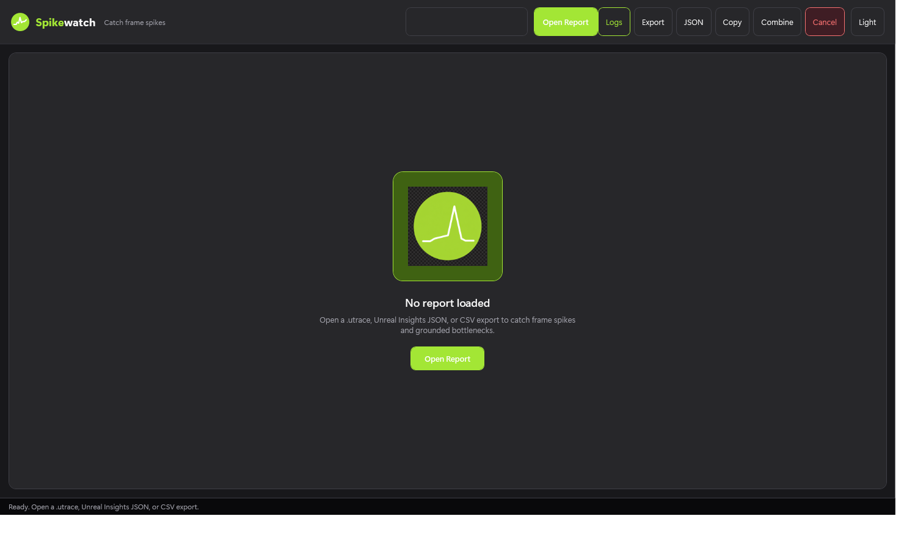
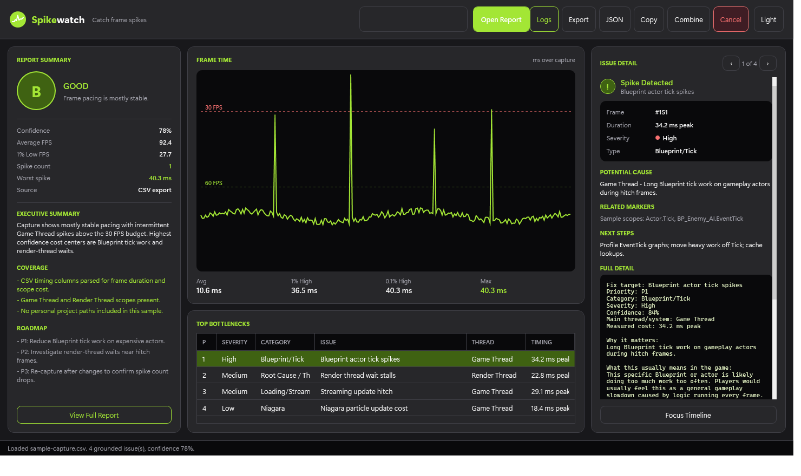
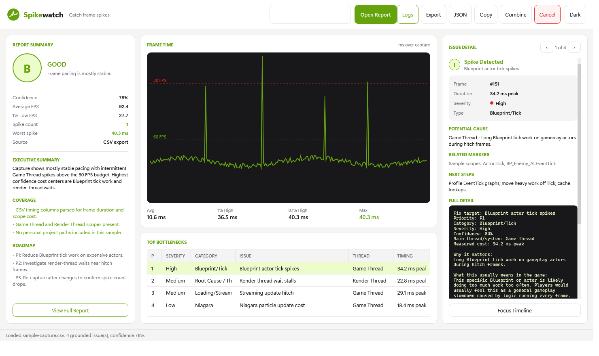

# Spikewatch

**Developed by [Pratik Kuratkar](https://github.com/baymax-pratik)**

**Spikewatch** is a Windows desktop app for **Unreal Engine** and **Meta Quest** performance triage.

Load a capture, see where frame time spikes, review grounded bottlenecks, and export a report you can share with your team.

---

## Download

| Platform | Package |
|----------|---------|
| Windows 10/11 (x64) | [**Spikewatch v1.0.0**](https://github.com/baymax-pratik/Spikewatch-Releases/releases/latest) |

1. Download `Spikewatch-win-x64-*.zip` from **[Releases](https://github.com/baymax-pratik/Spikewatch-Releases/releases)**
2. Unzip anywhere
3. Run `Spikewatch.exe`

**Requirements:** Windows x64 only. This build is **self-contained** — you do **not** need to install .NET separately.

---

## Screenshots

Screenshots below are captured from the **real Spikewatch UI** using a sanitized sample session (`sample-capture.csv`). No personal paths, usernames, or project folders are shown.

### Empty state

### Workspace — dark theme

### Workspace — light theme

---

## What it does

- **Open** `.utrace`, Unreal Insights **JSON**, or timing **CSV** exports
- **Frame-time chart** with 60 / 30 FPS guides and hitch spikes
- **Report summary** with grade, confidence, FPS, spike count, and worst hitch
- **Top bottlenecks** table (severity, category, thread, timing)
- **Issue detail** with cause, markers, next steps, and full write-up
- **Export** Markdown / JSON, copy report, combine fix lists
- **Log Analyzer** for Quest / UE log triage and compare

---

## Quick start

1. Capture or export timing data from Unreal Insights (CSV / JSON preferred)
2. In Spikewatch, click **Open Report**
3. Review the grade, chart, and top bottlenecks
4. Select an issue on the right for grounded next steps
5. **Export** Markdown when you are ready to share

---

## Privacy note on screenshots & samples

Public screenshots and demo copy use **placeholder** capture names and generic Unreal scope labels only. Do not publish captures that include private project paths, account names, or proprietary asset names.

---

## Support / source

Development source is maintained separately. This repository is the **public download** channel for release builds.

If something breaks on download or launch, open an issue on this repo.

## Author / Developer

**Pratik Kuratkar** ([@baymax-pratik](https://github.com/baymax-pratik))
